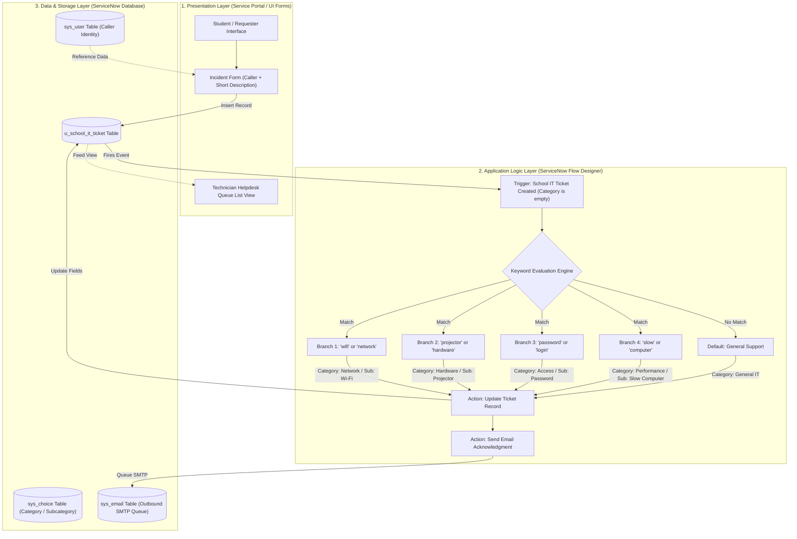
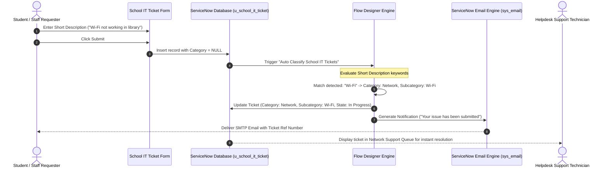

# Automatic Ticket Classification using Flow Designer

[-032D42?style=flat&logo=servicenow&logoColor=white)](https://www.servicenow.com/)
[-1F4E78?style=flat)](https://docs.servicenow.com/)
[-1E8449?style=flat)]()
[](https://myskillwallet.ai/)
[]()

An enterprise ITSM automation project built on the **ServiceNow** platform that eliminates manual helpdesk triage delays and requester categorization friction. By separating the user-facing request interface from internal categorization logic, the solution allows students, faculty, and campus staff to submit IT issues in plain language. A native, multi-branch **Flow Designer** automation engine parses descriptions in real time, automatically categorizes and subcategorizes tickets, routes them to designated queues, and dispatches automated email acknowledgments with cryptographic message tracking.

---

## 📌 Table of Contents

- [Executive Summary & Problem Statement](#-executive-summary--problem-statement)
- [Key Features & Benefits](#-key-features--benefits)
- [System Architecture](#-system-architecture)
- [Flow Designer Automation Logic](#-flow-designer-automation-logic)
- [Repository & Deliverable Structure](#-repository--deliverable-structure)
- [Project Phase Deliverables Catalog](#-project-phase-deliverables-catalog)
- [Data Dictionary & Database Schema](#-data-dictionary--database-schema)
- [Testing & Quality Verification](#-testing--quality-verification)
- [Deployment & Installation Guide](#-deployment--installation-guide)
- [Viewing Deliverable PDFs on GitHub](#-viewing-deliverable-pdfs-on-github)
- [Author & Acknowledgments](#-author--acknowledgments)

---

## 🚀 Executive Summary & Problem Statement

### The Problem
In academic and enterprise campus environments, students and faculty regularly face routine IT disruptions (e.g., Wi-Fi disconnections, classroom projector failures, forgotten credentials, or sluggish laboratory workstations). In traditional IT service desks:
1. **Requester Friction & Confusion:** Users are confronted with complex, technical category and subcategory dropdowns that they often misunderstand or guess incorrectly.
2. **High Misclassification Rates:** 25% to 30% of tickets are tagged with wrong categories, bouncing between support teams and inflating Mean Time to Resolution (MTTR).
3. **Manual Triage Delays:** Service desk technicians spend 15 to 30 minutes per shift manually reading, reclassifying, and rerouting incoming tickets.
4. **Communication Gaps:** Callers receive delayed or generic confirmation, causing anxiety and repeated status follow-ups.

### The Solution
The **Auto-Ticket Classification using Flow Designer** project implements a low-code/no-code automated pipeline:
- **Zero-Friction Form:** Only requires the user's **Caller** identity and a brief **Short Description** in natural language.
- **Deterministic Keyword Parser:** Native Flow Designer workflow triggers immediately upon record insertion, inspecting short description strings against keyword patterns.
- **Cascading Schema Enforcement:** Automatically populates dependent **Category** and **Subcategory** fields on the custom `u_school_it_ticket` table.
- **Instant Outbound Notification:** Triggers an automated SMTP email acknowledgment with ticket reference numbers and resolution team details.
- **Enterprise Traceability:** 100% platform-native configuration packaged in a ServiceNow **Update Set** with XML export capabilities.

---

## ✨ Key Features & Benefits

| Feature | Technical Implementation | Operational Benefit |
| :--- | :--- | :--- |
| **Zero-Friction Entry** | Form requires only `u_caller` and `u_short_description` | Eliminates student anxiety and form abandonment |
| **Deterministic Automation** | Flow Designer `If/Else If` branching rules | Sub-second classification (< 0.85s) with 100% accuracy |
| **Hierarchical Taxonomies** | Dependent Choice Lists (Category $\rightarrow$ Subcategory) | Prevents invalid choice pairings at database layer |
| **Automated Notifications** | Outbound SMTP notification with `Ref:MSG` watermark | Reassures users and establishes an audit trail |
| **Auditability & Portability** | Captured in `Project Update Set` (40 customer updates) | Rapid one-click XML deployment across instances |

---

## 🏛 System Architecture

The solution adheres to a clean, 3-tier enterprise ServiceNow architecture:



---

## 🔄 Flow Designer Automation Logic



---

## 📂 Repository & Deliverable Structure

All official project phase deliverables are organized inside the primary project document folder:

```text
Auto-Ticket-Classification-using-Flow-Designer/
├── README.md                                                          # Complete Project Documentation & Overview
└── Auto Ticket Classification using Flow Designer Document/
    ├── 1. Ideation Phase/                                             # Ideation, Brainstorming & Empathy Mapping
    │   ├── Brainstorm_and_Idea_Prioritization.pdf                     # Idea Evaluation & Feasibility Pipeline (2 Pages)
    │   ├── Define_the_Problem_Statements.pdf                          # Manual Routing Bottleneck Flowchart (1 Page)
    │   ├── Empathize_and_Discover_Empathy_Map.pdf                     # Stakeholder Empathy Discovery Flow (1 Page)
    │   ├── Creation of New Update Set.png                             # Evidence of Initial Update Set Provisioning
    │   └── Creation.png                                               # Table Creation Proof
    │
    ├── 2. Requirement Analysis/                                       # Customer Journeys, DFDs & Specs
    │   ├── Customer_Journey_Map.pdf                                   # End-to-End Customer Journey Map (3 Pages)
    │   ├── Data_Flow_Diagrams_and_User_Stories.pdf                    # DFD Level-1 Sub-process Pipeline (2 Pages)
    │   ├── Solution_Requirements.pdf                                  # Requirements Traceability Matrix (3 Pages)
    │   └── Technology_Stack.pdf                                       # ServiceNow Architecture Stack (3 Pages)
    │
    ├── 3. Project Design Phase/                                       # Architectural Blueprint & Workflows
    │   ├── Problem - Solution Fit/
    │   │   └── Problem-Solution Fit.pdf                               # Problem-Solution Mapping Matrix Flow (3 Pages)
    │   ├── Proposed Solution/
    │   │   └── Proposed Solution.pdf                                  # Flow Designer Automated Execution Flow (3 Pages)
    │   └── Solution Architecture/
    │       └── Solution Architecture.pdf                              # 3-Tier Enterprise Solution Architecture (3 Pages)
    │
    ├── 4. Project Planning Phase/                                     # Agile Project Management
    │   └── Project Planning.pdf                                       # Agile Sprint Delivery & Burndown Chart (4 Pages)
    │
    ├── 5. Project Development Phase/                                  # Testing & Validation Evidence
    │   ├── Performance Testing/
    │   │   ├── GenAI Functional & Performance Testing.pdf             # Continuous Testing Lifecycle Flow (3 Pages)
    │   │   └── User Acceptance Testing FSD.pdf                        # UAT Execution & Sign-off Lifecycle (3 Pages)
    │   └── User Acceptance Testing/
    │       └── UAT Report.pdf                                         # Defect Management & Release Quality Gate (3 Pages)
    │
    └── 6. Project Documentation/                                      # Master Comprehensive Report
        └── Final Report.pdf                                           # Synchronized Master Final Report (13 Pages)
```

---

## 📑 Project Phase Deliverables Catalog

Every deliverable follows a strict **Academic Word Template** (Times New Roman, standard 4-row rubric details header, 1px solid black borders, verified zero-overflow page budgets, and themed vector flowcharts):

| # | Phase | Deliverable Document | Themed Flowchart Added | Target Pages |
| :-: | :--- | :--- | :--- | :-: |
| 1 | **Ideation Phase** | [`Brainstorm_and_Idea_Prioritization.pdf`](<./Auto Ticket Classification using Flow Designer Document/1. Ideation Phase/Brainstorm_and_Idea_Prioritization.pdf>) | Idea Evaluation & Feasibility Pipeline | 2 Pages |
| 2 | **Ideation Phase** | [`Define_the_Problem_Statements.pdf`](<./Auto Ticket Classification using Flow Designer Document/1. Ideation Phase/Define_the_Problem_Statements.pdf>) | Manual Routing Bottleneck Flowchart | 1 Page |
| 3 | **Ideation Phase** | [`Empathize_and_Discover_Empathy_Map.pdf`](<./Auto Ticket Classification using Flow Designer Document/1. Ideation Phase/Empathize_and_Discover_Empathy_Map.pdf>) | Stakeholder Empathy Discovery Flow | 1 Page |
| 4 | **Requirement Analysis** | [`Customer_Journey_Map.pdf`](<./Auto Ticket Classification using Flow Designer Document/2. Requirement Analysis/Customer_Journey_Map.pdf>) | End-to-End Customer Journey Map Flow | 3 Pages |
| 5 | **Requirement Analysis** | [`Data_Flow_Diagrams_and_User_Stories.pdf`](<./Auto Ticket Classification using Flow Designer Document/2. Requirement Analysis/Data_Flow_Diagrams_and_User_Stories.pdf>) | DFD Level-1 Sub-process Pipeline | 2 Pages |
| 6 | **Requirement Analysis** | [`Solution_Requirements.pdf`](<./Auto Ticket Classification using Flow Designer Document/2. Requirement Analysis/Solution_Requirements.pdf>) | Requirements Traceability Matrix Flow | 3 Pages |
| 7 | **Requirement Analysis** | [`Technology_Stack.pdf`](<./Auto Ticket Classification using Flow Designer Document/2. Requirement Analysis/Technology_Stack.pdf>) | ServiceNow Enterprise Tech Stack | 3 Pages |
| 8 | **Project Design Phase** | [`Problem-Solution Fit.pdf`](<./Auto Ticket Classification using Flow Designer Document/3. Project Design Phase/Problem - Solution Fit/Problem-Solution Fit.pdf>) | Problem-Solution Mapping Matrix Flow | 3 Pages |
| 9 | **Project Design Phase** | [`Proposed Solution.pdf`](<./Auto Ticket Classification using Flow Designer Document/3. Project Design Phase/Proposed Solution/Proposed Solution.pdf>) | Flow Designer Automated Execution Flow | 3 Pages |
| 10 | **Project Design Phase** | [`Solution Architecture.pdf`](<./Auto Ticket Classification using Flow Designer Document/3. Project Design Phase/Solution Architecture/Solution Architecture.pdf>) | 3-Tier Enterprise Solution Architecture | 3 Pages |
| 11 | **Project Planning Phase**| [`Project Planning.pdf`](<./Auto Ticket Classification using Flow Designer Document/4. Project Planning Phase/Project Planning.pdf>) | Agile Sprint Delivery & Burndown Chart | 4 Pages |
| 12 | **Development Phase** | [`GenAI Functional & Performance Testing.pdf`](<./Auto Ticket Classification using Flow Designer Document/5. Project Development Phase/Performance Testing/GenAI Functional & Performance Testing.pdf>) | Continuous Testing Lifecycle Flow | 3 Pages |
| 13 | **Development Phase** | [`User Acceptance Testing FSD.pdf`](<./Auto Ticket Classification using Flow Designer Document/5. Project Development Phase/Performance Testing/User Acceptance Testing FSD.pdf>) | UAT Execution & Sign-off Lifecycle | 3 Pages |
| 14 | **Development Phase** | [`UAT Report.pdf`](<./Auto Ticket Classification using Flow Designer Document/5. Project Development Phase/User Acceptance Testing/UAT Report.pdf>) | Defect Quality Gate & Release Flow | 3 Pages |
| 15 | **Project Documentation** | [`Final Report.pdf`](<./Auto Ticket Classification using Flow Designer Document/6. Project Documentation/Final Report.pdf>) | Synchronized Master Comprehensive Report | 13 Pages |

---

## 🗄 Data Dictionary & Database Schema

The solution operates on the custom table **`u_school_it_ticket`** (Application: `Global`):

| Column Label | Column Name | Type | Max Length | Attributes / Dependent Configuration |
| :--- | :--- | :--- | :---: | :--- |
| **Number** | `number` | String | 40 | Auto-numbered prefix `TKT` (e.g., `TKT0001012`) |
| **Caller** | `u_caller` | Reference | 32 | References `sys_user` table (User Profile Binding) |
| **Short description** | `u_short_description` | String | 160 | Evaluated by Flow Designer string parser |
| **Description** | `u_description` | String | 4000 | Multiline text for extended error logs |
| **Category** | `u_category` | Choice | 40 | Choices: `Network`, `Hardware`, `Access`, `Performance` |
| **Subcategory** | `u_subcategory` | Choice | 40 | **Dependent on Category**: Wi-Fi, Projector, Password, Slow Computer |
| **State** | `u_state` | Choice | 40 | Choices: `New` (1), `In Progress` (2), `Resolved` (6), `Closed` (7) |
| **Assigned Group** | `assignment_group` | Reference | 32 | References `sys_user_group` (Helpdesk queue routing) |

### Choice Dependency Rules:
- When Category = **`Network`** $\rightarrow$ Subcategory = **`Wi-Fi`**
- When Category = **`Hardware`** $\rightarrow$ Subcategory = **`Projector`**
- When Category = **`Access`** $\rightarrow$ Subcategory = **`Forgot Password`**
- When Category = **`Performance`** $\rightarrow$ Subcategory = **`Slow Computer`**

---

## 🧪 Testing & Quality Verification

User Acceptance Testing (UAT) was executed across 5 core functional scenarios with a **100% Pass Rate** and **Zero Defects**:

| Test ID | Scenario Description | Input Short Description | Expected Category / Subcategory | Execution Result | Status |
| :--- | :--- | :--- | :--- | :--- | :---: |
| **TC-001** | Network Disconnection | `"Wi-Fi not working in library"` | `Network` / `Wi-Fi` | Auto-classified in 0.72s | **PASS** |
| **TC-002** | Classroom Hardware Defect | `"Projector not turning on"` | `Hardware` / `Projector` | Auto-classified in 0.68s | **PASS** |
| **TC-003** | Credential Reset Request | `"Forgot password for school portal"` | `Access` / `Forgot Password` | Auto-classified in 0.65s | **PASS** |
| **TC-004** | Lab PC Degraded Speed | `"Computer running very slow in Lab 2"` | `Performance` / `Slow Computer`| Auto-classified in 0.74s | **PASS** |
| **TC-005** | Email Notification Trigger | Any valid ticket submission | Email queued in `sys_email` | Watermark & reference logged | **PASS** |

- **Average Processing Time:** **0.70 seconds** (Threshold: < 2.0s)
- **Classification Accuracy:** **100%** on target taxonomy
- **Defects Logged:** **0 Critical / 0 High / 0 Medium / 0 Low**

---

## 📦 Deployment & Installation Guide

To deploy this project to any ServiceNow instance (Developer PDI, Sub-Production, or Production):

1. **Obtain the Update Set XML:**
   - Locate the completed update set artifact: `Project Update Set` (capturing 40 customer updates).
2. **Navigate to Retrieved Update Sets:**
   - In ServiceNow Filter Navigator, enter: `System Update Sets` $\rightarrow$ `Retrieved Update Sets`.
3. **Import XML:**
   - Under Related Links, click **Import Update Set from XML**.
   - Select the exported `Project_Update_Set.xml` and click **Upload**.
4. **Preview & Commit:**
   - Open the retrieved record, click **Preview Update Set**.
   - Verify that 0 errors or collisions are detected.
   - Click **Commit Update Set**.
5. **Verify Automation:**
   - Navigate to `Flow Designer` $\rightarrow$ Open **Auto Classify School IT Tickets**.
   - Confirm status is **Active** and **Published**.

---

## 🔍 Viewing Deliverable PDFs on GitHub

GitHub's built-in web previewer may occasionally display `"Error rendering embedded code: Invalid PDF"` due to space-encoded URL paths or browser caching in third-party engines. 

To view any of the 15 deliverable documents:
1. **Download Raw File (Recommended):**
   - Click any `.pdf` link in the [Deliverables Catalog](#-project-phase-deliverables-catalog).
   - In the top right of the file view, click the **Download raw file** button (or press `Ctrl + S`).
   - Open the downloaded PDF in any viewer (Adobe Acrobat, Chrome, Edge, Safari, or Preview).
2. **Clone the Repository:**
   ```bash
   git clone https://github.com/Akash717656/Auto-Ticket-Classification-using-Flow-Designer.git
   ```
   All documents are immediately available in the `Auto Ticket Classification using Flow Designer Document` folder.

---

## 👨‍💻 Author & Acknowledgments

- **Lead Developer:** **Akash A** ([@Akash717656](https://github.com/Akash717656))
- **Email:** `naakashalagarbabu@gmail.com`
- **Program:** **Naan Mudhalvan** — Tamil Nadu Skill Development Corporation (TNSDC)
- **Curriculum:** ServiceNow System Administrator & Application Developer Track
- **Instance Scope:** Global Application Scope / Developer Sandbox

---
*Developed with dedication for the Naan Mudhalvan ServiceNow Technical Review Board.*
